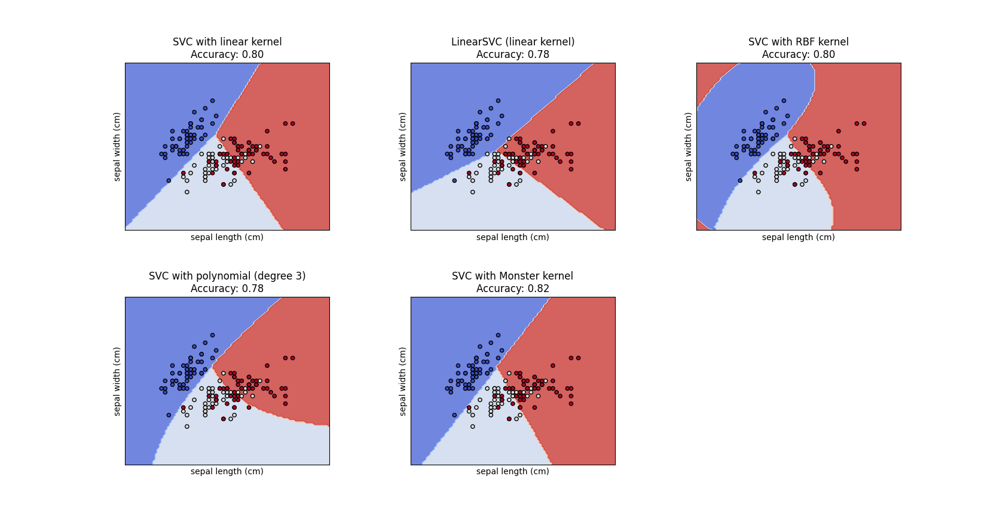

I can hardly do any interesting Machine Learning with the Monster Group. In vain, I have just leveraged the largeness of the 196,883 number to create a custom kernel for Support Vector Classification on the Iris dataset.

